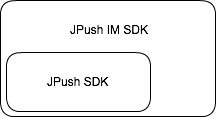
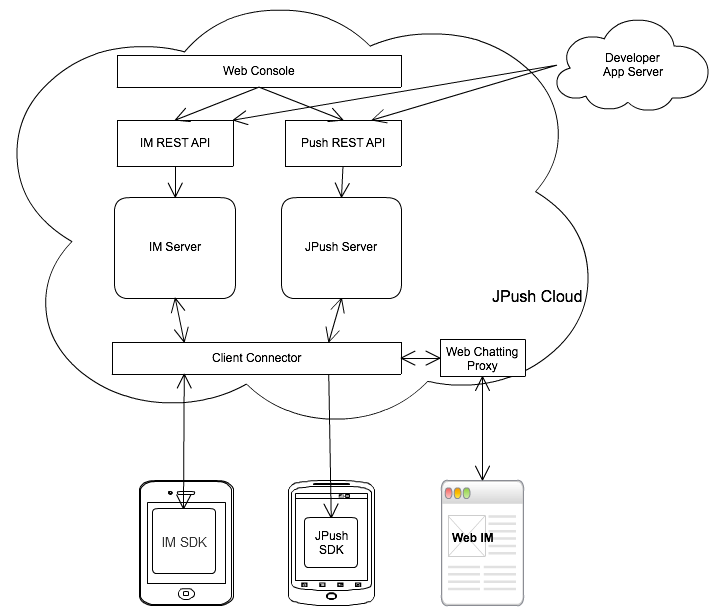

# 极光IM指南

### 认识极光IM

开发者可以通过极光IM 服务快速集成 IM 功能到 App 里。只需要很少的工作，集成 IM SDK，做简单的接口集成，就可以使得自己的 App 具备了用户间聊天的功能。

极光IM（英文名 JMessage）致力于帮助 App 解决 IM 聊天问题。其核心能力在于 IM 聊天本身。其他的附属功能是可选的。 开发者可选择只是单纯注册用户，然后让这些用户之间互发消息，而不使用其他附加功能。

鉴于好友关系的敏感性，我们暂时还未开放这部分功能。

#### JMessage 与 JPush 的关系

JMessage 以 JPush 技术作为基础，共享 JPush 的网络长连接。在保留了 JPush 推送全部功能的基础上增加了 IM 功能。 

集成 JMessage 服务的应用，从客户端 SDK，到服务端 REST API，Web 控制台，都具备并且兼容 JPush 的全部功能。

	对于同一个应用 JMessage 与 JPush 使用同样的 AppKey。

#### JMessage 与 JPush 的区别

  <table border="1" width="100%">
   <thead>
    <tr  bgcolor="#D3D3D3" >
      <th > </th>
      <th >JPush</th>
      <th >JMessage</th>
    </tr>
   </thead>
   <tbody>
    <tr>
      <td>使用场景</td>
      <td>应用推送</td>
      <td>IM聊天、社交 </td>
    </tr>
    <tr >
      <td>面向对象</td>
      <td>设备</td>
      <td>用户、帐号</td>
    </tr>
    <tr >
      <td>消息对象</td>
      <td>App 运营人员或者 App Server 向用户推送</td>
      <td>用户之间互相交流</td>
    </tr>
    <tr >
      <td>发送方式</td>
      <td>支持广播、Tag，或者单设备 </td>
      <td>单聊、群群 </td>
    </tr>
  </table>

 
JMessage 以 IM 使用场景出发，面向用户根据登录帐号来收发消息；而 JPush 则满足推送场景，面向移动设备，根据设备的标签以及使用属性进行推送。

#### 推送与 IM 服务如何选择

开发者可以根据自身业务场景来选择适用的业务。

### JMessage 基本概念

##### username（用户名）

这是 App 的用户名，App 里用来唯一地标识其用户。必须唯一！

App 调用 IM SDK 时实际使用的，可以是其用户的 ID，用户帐号名，或者 Email，总之任何一个唯一地标识其用户的，都可以。

##### groupId（群组ID）

App 使用 JMessage 提供的群组功能创建群组时，得到的群组标识。之后发群组消息、加人踢人等操作，都需要这个群组ID。

##### AppKey（应用Key）

这是 JPush 用来唯一地标识一个 App 的标识，需要在 JPush Web Portal 上去创建。SDK 集成时，需要配置此 Key，以便 JPush 识别当前用户属于某个应用。

同一个 AppKey 里用户名必须唯一！ 不同的 AppKey 之间用户名可以重名。

* 如果你的应用需要实现用户之间相互传递消息的 IM 功能，那么 JMessage 是为您准备的。
* 如果应用主要以发送功能通知，活动推广，订阅与广播内容为主，应该选择更为简洁的推送服务。如果后续业务上需要扩展，可以再集成 JMessage，平滑添加，对原有的 Push 功能无任何影响。

#### JPush 更新后的架构

上图是 JPush 新增了 IM 服务后的整体架构图。通过此图可以理解：

+ IM SDK 里支持的推送部分，与 IM 部分使用同一个网络长连接。
+ 服务器端接入服务器在两个服务之间是共享的。
+ 接入服务器之上，二套服务整体相对独立、分离。

#### JMessage 的相对优势

+ 基于 JPush 的大规模、高并发、稳定的推送服务的技术基础，JMessage 服务从刚开始就是相对稳定、可靠、大容量的即时消息服务。
+ IM SDK 与 JPush SDK 合并在一起，一个网络连接同时支持 IM 与 Push 业务。
+ IM 业务与 Push 业务完美集成，先使用 Push 服务时可平滑升级。
+ JPush 团队之前就是开发 IM App 的，对 IM 业务具有更深刻的理解，能够持续地改进与革新 IM 服务。

### JMessage 功能与特性

#### 整体特性

+ 聊天类型：文本、语音、图片。
+ 聊天对象：单聊、群聊。
+ 平台支持：Android, iOS，Web端三平台互通。
+ 用户维护：注册、登录、头像、用户其他信息。
+ 群组维护：创建群组、加群、退群。一个用户最多参与100个群组。
+ 离线消息：单个用户每个会话支持100条离线消息，离线消息和离线事件保存时长分别是15天和7天。

好友关系维护相关功能，稍后的版本提供。

#### 客户端

+ Android 
	+ IM SDK（含 JPush SDK）
	+ Demo （IM 功能完备的 App）
+ iOS 
	+ IM SDK（含 JPush SDK）
	+ Demo （IM 功能完备的 App）
+ Web
	+ 暂未发布。在线 Web IM 登录使用，可进行单聊、群聊。

#### REST API

提供满足 REST 规范的 HTTP API 来使用常用的功能。

有如下几个类别：

+ 注册用户（支持批量）
+ 发送消息
+ 用户信息维护
+ 群组维护

#### Web Portal

与 JPush 网站控制台集成在一起，可进行除了应用维护之外的操作。

+ 创建应用
+ 发送消息
+ 注册用户
+ 维护群组

### 集成流程

1. 在 Web 控制台上创建应用，得到 AppKey。如果是之前已经使用 JPush，可以直接延用老的 AppKey。
2. 集成客户端 SDK。
	+ 集成 IM SDK 到 App 里。具体参考 Android, iOS 各平台的相应文档。
	+ 如果 App 里之前已经集成过 JPush SDK，则可直接升级换成 IM SDK。
3. 通过 Web 控制台，或者调用 REST API 管理用户，发送消息。

#### Web Client 使用

在 Web 控制台上，应用的展示界面，可以找到该应用的 Web IM 入口。从这个入口，该 App 的用户，可以凭用户名与密码登录，使用 Web 端参与聊天。

以后将发布 Web Client 给开发定制，嵌入到自己的网站上。

### 相关文档

+ [IM SDK for Android](../client/im_sdk_android/)
+ [IM SDK for iOS](../client/im_sdk_ios/)
+ [IM REST API](../server/rest_api_im/)
+ [IM 内部消息协议](../advanced/im_message_protocol/)
+ [IM 业务对象](../advanced/im_objects/)
+ [JPush Android SDK 集成指南](../client/jmessage_android_guide/)

