# iOS 证书 设置指南

## 创建应用程序ID

+ 登陆 [苹果开发者网站](https://developer.apple.com/) 进入开发者账户。

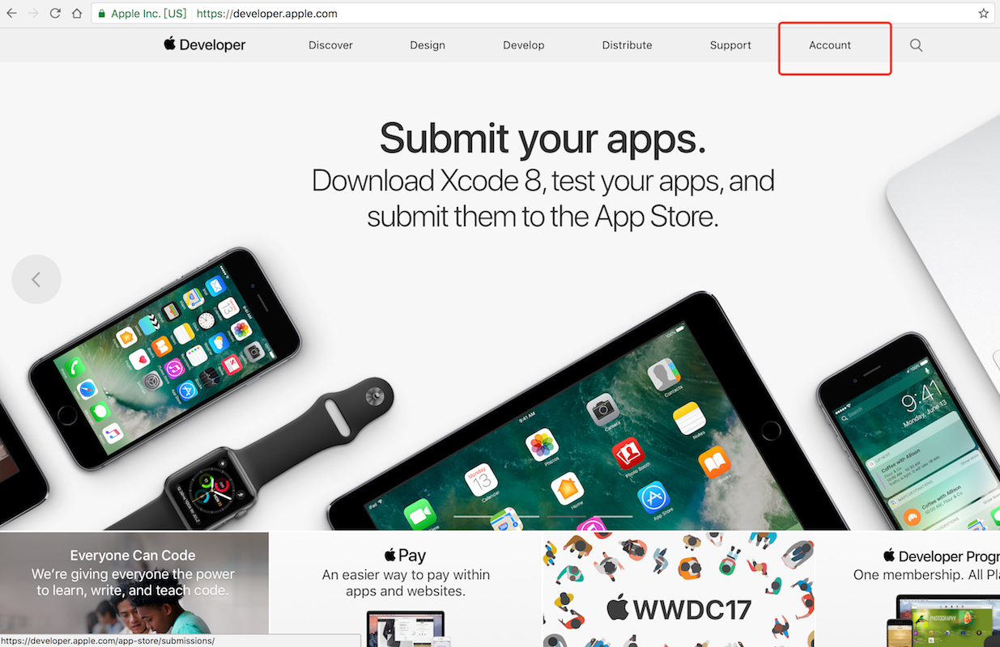

+ 从开发者账户页面左侧入口进入“Certificates, IDs & Profiles” 页面。

+ 创建 App ID，填写 App ID 的 NAME 和 Bundle ID（如果 ID 已经存在可以直接跳过此步骤）。

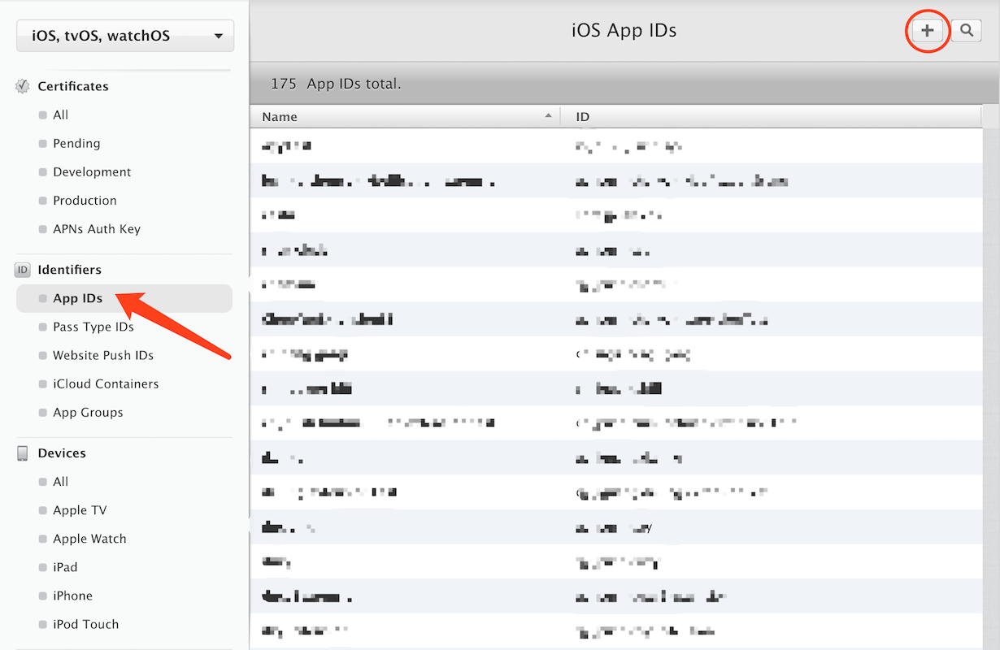
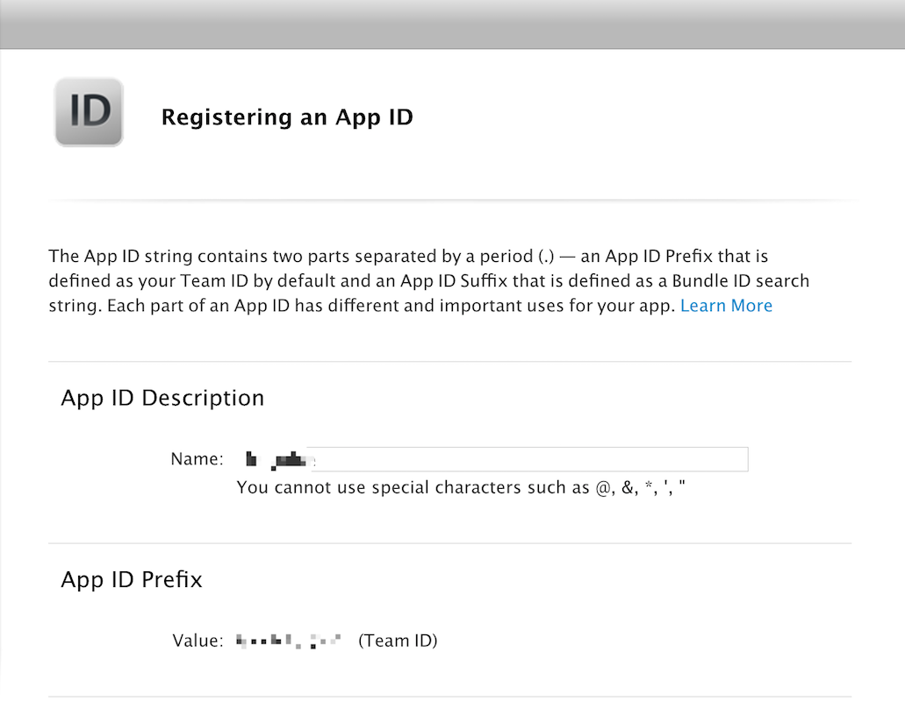

	注: 此处需要指定具体的 Bundle ID 不要使用通配符。
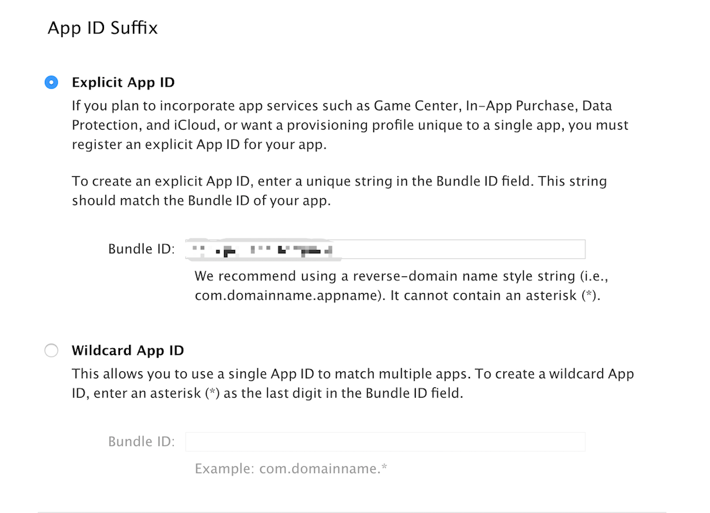

+ 为 App 开启 Push Notification 功能。如果是已经创建的 App ID 也可以通过设置开启 Push Notification 功能。

+ 填写好以上属性后，点击 “Continue”，确认 AppId 属性的正确性，点击 “Register”，注册 AppId 成功。

## 配置和下载证书

### 通过 .p12 证书鉴权

+ 如果你之前没有创建过 Push 证书或者是要重新创建一个新的，请在证书列表下面新建。

+ 新建证书需要注意选择证书种类（开发证书用于开发和调试使用，生产证书既能开发调试使用，也可用于 App Store 发布）

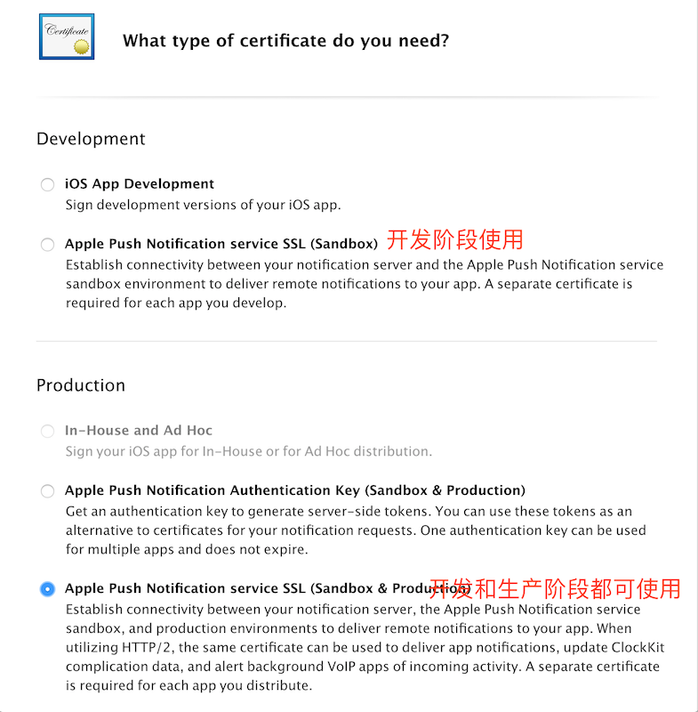

+ 点击 "Continue", 之后选择该证书准备绑定的 App ID。

+ 点击 “Continue”，会进入 CSR 说明界面。

+ 再点 “Continue” 会让你上传 CSR 文件。

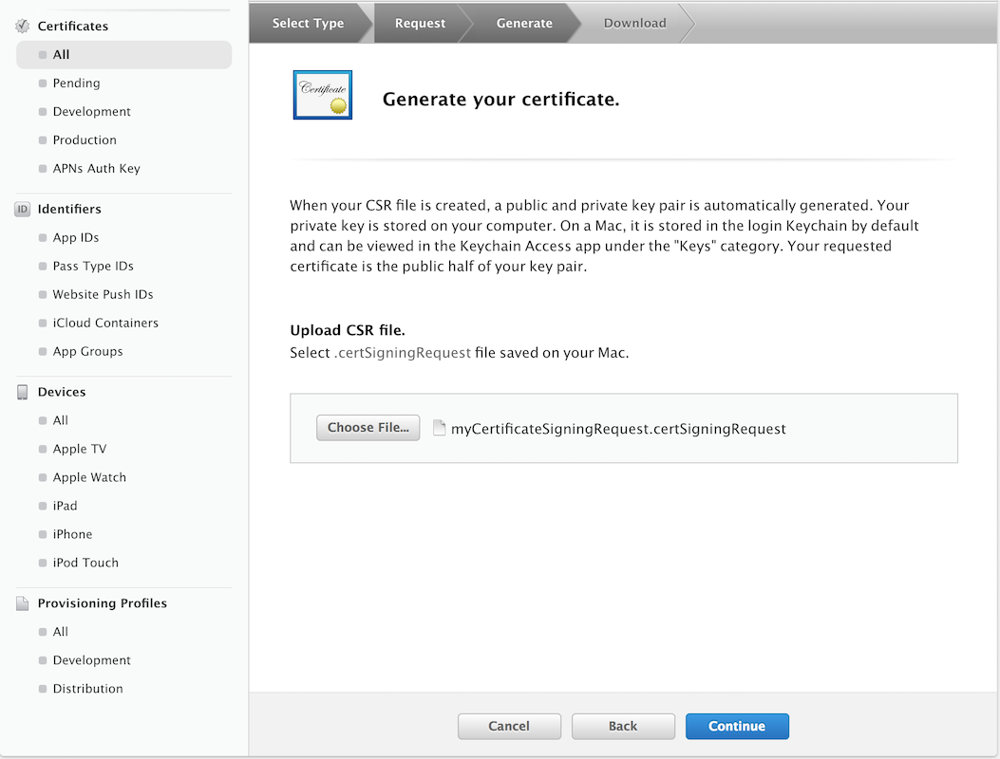

+ 根据它的说明创建打开KeychainAccess 创建 Certificate Signing Request。

+ 填写“User Email Address”和“Common Name” 后选择 Saved to disk 进行保存 。

+ 继续返回Apple developer 网站点击 Continue ，上传刚刚生成的 .certSigningRequest 文件生成 APNs Push  Certificate。
+ 生成证书成功后，点击 “Download” 按钮把证书下载下来。

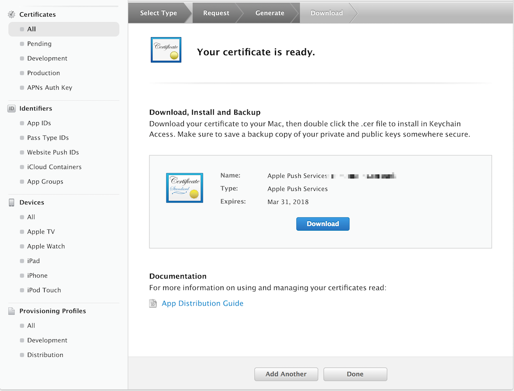

+ 双击证书后，会在“KeychainAccess”中打开，左侧“钥匙串”列表选择“登录”，“种类”列表选择“我的证书”，找到刚才下载的证书，并导出为 .p12 文件。

+ 在极光控制台上传证书

在 [JPush 管理 Portal 上](https://www.jiguang.cn/app/list)，针对某应用程序，上传上面步骤得到 .p12 证书文件。这是 iOS SDK 能够接收到 JPush 推送消息的必要步骤。

### 通过 Auth Key 鉴权

+ 首先进入 “APNs Auth Key” 页面看账户中是否已经有 auth key，没有则点击 “+” 新建。

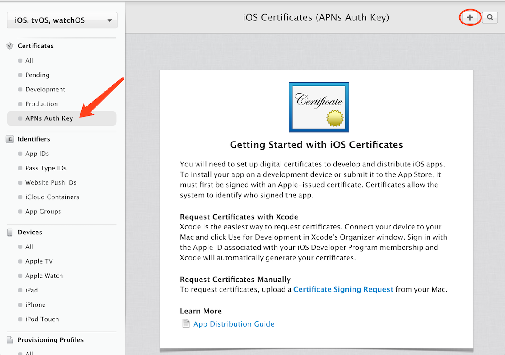

+ 选择 Authentication Key 的类型 （注意：在开发和生产环境均可使用，且不会过期）

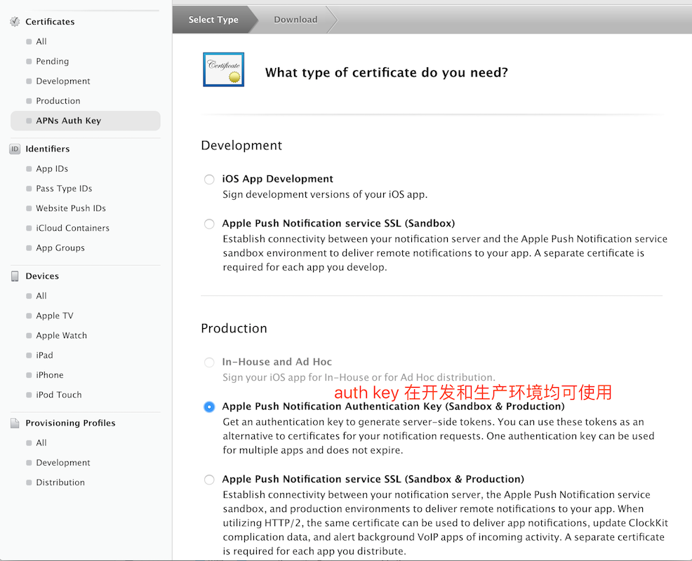

+ 点击 “Continue” 进入 Auth Key 详情页将证书下载下来，并获取 Key ID（注意：只可以下载一次，下载后妥善保存）

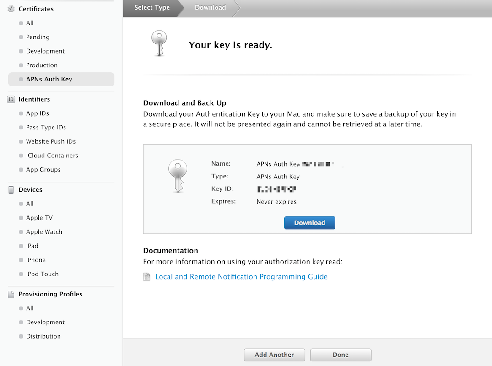

+ 在账户的 “Membership” 页面获取 Team ID

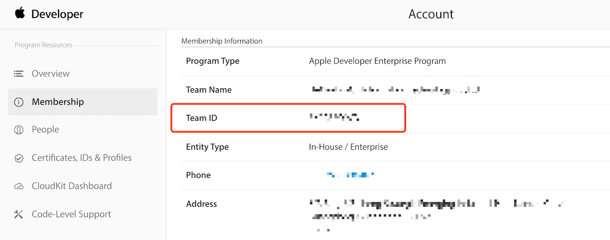

+ 在极光控制台上传 auth key 文件，并填写你的 KEY ID，TeamID，和指定应用的 BundleID。

## Provisioning Profile的创建

+ 创建Provisioning Profile的前提，已在Apple Developer网站创建待发布应用所使用的Bundle ID的App ID，且为该App ID创建了APNs证书，如下图:

+ 创建App ID、APN证书和p12证书的导出的具体步骤请看 :[iOS 证书 设置指南](#id)

+ 在[苹果开发者账号的Provisioning Profile](https://developer.apple.com/account/ios/profile/profileList.action)页面点击下图按钮，创建Provisioning Profile

+ 选择此Provisioning Profile的环境后点击[Continue]：

+ 选择要创建Provisioning Profile的App ID后点击[Continue]：

+ 选择所属的开发者证书，（这里创建了多个开发者证书，建议只创建一个，方便管理）为了方便，选择了[Select All]，再点击[Continue]进入下一步：

+ 为该Provisioning Profile选择将要安装的设备（一般选择[Select All]），点击[Continue]:

+ 给该Provisioning Profile填写Profile Name，点击[generate]完成创建。

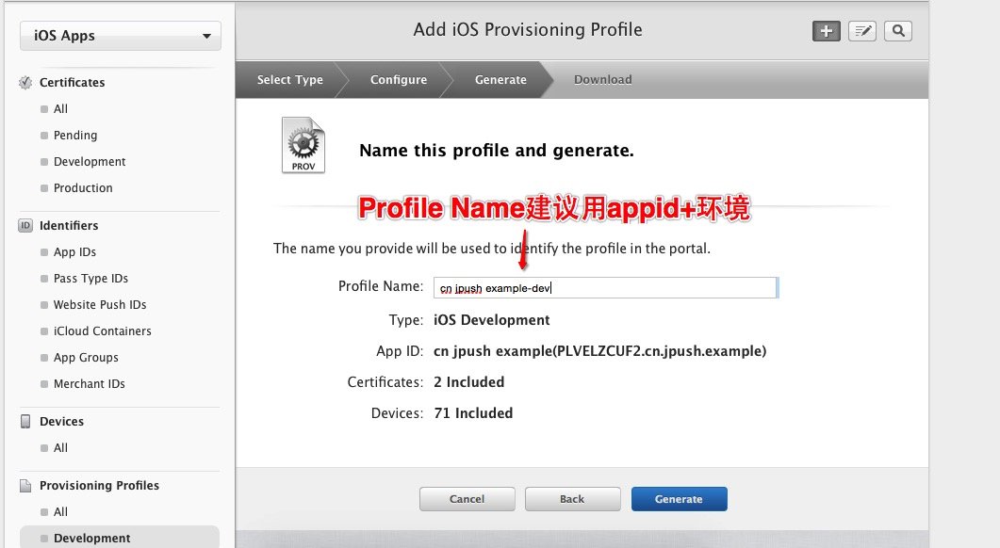

+ 填写完Profile Name后点击[generate]完成创建，之后点击[DownLoad]下载Provisioning Profile

+ 双击下载下来的Provisioning Profile，添加到xcode。

## XCode的证书配置教程

参照[iOS SDK 集成指南](ios_guide_new/)集成JPush SDK 和上传了推送用到的p12证书后在编译运行前需要先配置一下证书，步骤如下：

+ 打开xxx-info.plist的Bundle identifier项把上传到JPush 控制台的bundle id填写进去：

+ 点击项目，选择目标TARGETS后进入Build Setting 界面，搜索“Code signing”，按照下图配置

