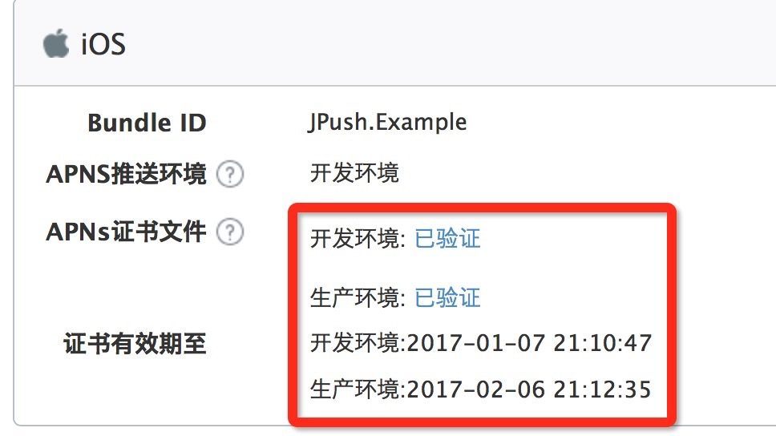
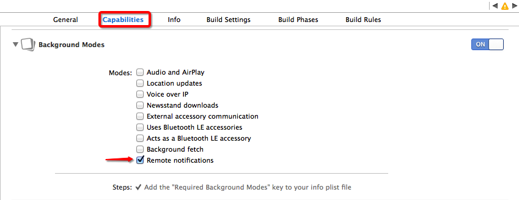

# iOS SDK 常见问题

<style>
img[alt=jpush_ios] { width: 800px; }
img[alt=jpush_ios_5] { width: 500px; }## 
</style>

## iOS SDK 调试指南

### iOS 调试思维导图


### 确认证书

请到“应用详情页面”确认证书可用性：



### 开发环境测试

在对  JPush iOS 开发环境进行测试前，请确保 3 个统一：

+ App 是开发环境打包（开发证书 Development）
+ 上传了开发证书并验证通过
+ Portal 上的应用设置为开发环境

### 发布环境测试

在对  JPush iOS 生产环境进行测试前，请确保 3 个统一：

+ App 是 ad-hoc 打包或者App Store 版本（发布证书 Production）
+ 上传了发布证书并验证通过
+ Portal 上的应用设置为生产环境

### 可能存在的其他问题

#### 收到消息不够稳定

JPush iOS 是对原生官方 APNs 推送的一个补充，是对其的封装，以帮助开发人员更轻松地使用 APNs 。

由于APNs 本身不承诺保证消息到达，客户端网络与服务器端的连通性，对 APNs 是否及时接收到消息具有很大的影响。


## iOS 7 Background Remote Notification


本次iOS 7在推送方面最大的变化就是允许，应用收到通知后在后台（background）状态下运行一段代码，可用于从服务器获取内容更新。功能使用场景：（多媒体）聊天，Email更新，基于通知的订阅内容同步等功能，提升了终端用户的体验。

Remote Notifications 与之前版本的对比可以参考下面两张 Apple 官方的图片便可一目了然。


如果只携带content-available: 1 不携带任何badge，sound 和消息内容等参数，则可以不打扰用户的情况下进行内容更新等操作即为“Silent Remote Notifications”。


### 客户端设置

#### 开启Remote notifications

需要在Xcode 中修改应用的 Capabilities 开启Remote notifications，请参考下图：



#### 修改通知处理函数

当注册了Backgroud Modes -> Remote notifications 后，notification 处理函数一律切换到下面函数，后台推送代码也在此函数中调用。

	- (void)application:(UIApplication *)application didReceiveRemoteNotification:(NSDictionary *)userInfo fetchCompletionHandler:(void (^)(UIBackgroundFetchResult))completionHandler；

### 服务端推送设置

推送消息携带 content-available: 1 是Background 运行的必须参数，如果不携带此字段则与iOS7 之前版本的普通推送一样。

#### 使用Web Portal 推送

在“可选设置内”选择对应的参数。


#### 使用 API 推送

只需在[Push API v3](../../server/push/rest_api_v3_push/#notification) 的 ios 内附加content-available":true 字段即可

### 限制与注意

+ “Silent Remote Notifications”是在 Apple 的限制下有一定的频率控制，但具体频率不详。所以并不是所有的 “Silent Remote Notifications” 都能按照预期到达客户端触发函数。
+ “Background”下提供给应用的运行时间窗是有限制的，如果需要下载较大的文件请参考 Apple 的 NSURLSession 的介绍。
+ “Background  Remote Notification”  的前提是要求客户端处于Background 或 Suspended 状态，如果用户通过 App Switcher 将应用从后台 Kill 掉应用将不会唤醒应用处理 background 代码。

更详细的说明资料请查阅 Apple 官方的 iOS 开发文档。


## iOS 8 UIUserNotificationSettings

### 支持版本
v1.8.0 版本开始。

+ 本次iOS 8在推送方面最大的变化就是修改了推送的注册接口，在原本的推送type的基础上，增加了一个categories参数，这个参数的目的是用来注册一组和通知关联起来的button的事件。
+ 这个categories由一系列的 UIUserNotificationCategory组成。每个UIUserNotificationCategory对象包含你的app用来响应本地或者远程通知的信息。每一个对象的title作为通知上每一个button的title展示给用户。当用户点击了某一个button，系统将会调用应用内的回调函数[application:handleActionWithIdentifier:forRemoteNotification:completionHandler:](https://developer.apple.com/library/prerelease/ios/documentation/UIKit/Reference/UIApplicationDelegate_Protocol/index.html#//apple_ref/occ/intfm/UIApplicationDelegate/application:handleActionWithIdentifier:forRemoteNotification:completionHandler:)或者[application:handleActionWithIdentifier:forLocalNotification:completionHandler:](https://developer.apple.com/library/prerelease/ios/documentation/UIKit/Reference/UIApplicationDelegate_Protocol/index.html#//apple_ref/occ/intfm/UIApplicationDelegate/application:handleActionWithIdentifier:forLocalNotification:completionHandler:)。

### 客户端设置

#### 使用UIUserNotificationCategory

```
if ([[UIDevice currentDevice].systemVersion floatValue] >= 8.0) {
 
 NSMutableSet *categories = [NSMutableSet set];
 
 UIMutableUserNotificationCategory *category = [[UIMutableUserNotificationCategory alloc] init];
 
 category.identifier = @"identifier";
 
 UIMutableUserNotificationAction *action = [[UIMutableUserNotificationAction alloc] init];
 
 action.identifier = @"test2";
 
 action.title = @"test";
 
 action.activationMode = UIUserNotificationActivationModeBackground;
 
 action.authenticationRequired = YES;
 
 //YES显示为红色，NO显示为蓝色
 action.destructive = NO;
 
 NSArray *actions = @[ action ];
 
 [category setActions:actions forContext:UIUserNotificationActionContextMinimal];
 
 [categories addObject:category];
}
```

#### 使用UIUserNotificationType

```
if ([[UIDevice currentDevice].systemVersion floatValue] >= 8.0) {
[APService registerForRemoteNotificationTypes:(UIUserNotificationTypeBadge | UIUserNotificationTypeSound | UIUserNotificationTypeAlert)                      categories:categories];
}else{
[APService registerForRemoteNotificationTypes:(UIUserNotificationTypeBadge | UIUserNotificationTypeSound | UIUserNotificationTypeAlert)                      categories:nil];
}
```

#### 使用回调函数

```
// Called when your app has been activated by the user selecting an action from
// a remote notification.
// A nil action identifier indicates the default action.
// You should call the completion handler as soon as you've finished handling
// the action.
- (void)application:(UIApplication *)application handleActionWithIdentifier:(NSString *)identifier forRemoteNotification:(NSDictionary *)userInfo
  completionHandler:(void (^)())completionHandler {
}
```

### 服务端设置

服务端payload格式:aps增加category字段，当该字段与客户端UIMutableUserNotificationCategory的identifier匹配时，触发设定的action和button显示。

```
payload example:
{"aps":{"alert":"example", "sound":"default", "badge": 1, "category":"identifier"}}

```


## iOS 9 UIUserNotificationActionBehaviorTextInput

### 支持版本
v1.8.0 版本开始

1. 本次iOS 9在推送方面最大的变化就是修改了推送Category的类型，在原本的推送categories的基础上，增加了一个text Action类型，这个参数的目的是用来注册通过通知快捷文字输入的事项。
2. 这个categories由一系列的 UIUserNotificationCategory组成。每个UIUserNotificationCategory对象允许添加一组UIMutableUserNotificationAction类型的参数来增加通知栏上的项目。如今iOS9在原有的UIMutableUserNotificationAction类型增加了Text输入类型(UIUserNotificationActionBehaviorTextInput),通过behavior来设置(只有iOS9才拥有的属性)。
3. 回调的方法iOS9使用了两个新的回调方法来处理点击按钮的事件:

```
- (void)application:(UIApplication *)application handleActionWithIdentifier:(nullableNSString *)identifier forLocalNotification:(UILocalNotification *)notification withResponseInfo:(NSDictionary *)responseInfo completionHandler:(void(^)())completionHandler NS_AVAILABLE_IOS(9_0)

- (void)application:(UIApplication *)application handleActionWithIdentifier:(nullableNSString *)identifier forRemoteNotification:(NSDictionary *)userInfo withResponseInfo:(NSDictionary *)responseInfo completionHandler:(void(^)())completionHandler NS_AVAILABLE_IOS(9_0)

```

**说明**:

+ 当Action为UIUserNotificationActionBehaviorTextInput时,需要通过responseInfo的UIUserNotificationActionResponseTypedTextKey来获取输入的文字内容,UIUserNotificationTextInputActionButtonTitleKey获取点击的按钮类型.

+ 当Action为UIUserNotificationActionBehaviorDefault时,responseInfo为nil,通过identifier来区分点击按钮分别是什么来做处理. 

### 客户端设置

**设置带有快速回复内容的通知**

```
#ifdef __IPHONE_9_0 
 UIMutableUserNotificationAction *replyAction = [[UIMutableUserNotificationAction alloc]init];
 replyAction.title = @"Reply";
 replyAction.identifier = @"comment-reply";
 replyAction.activationMode = UIUserNotificationActivationModeBackground;
 replyAction.behavior = UIUserNotificationActionBehaviorTextInput;
  
 UIMutableUserNotificationCategory *category = [[UIMutableUserNotificationCategory alloc]init];
 category.identifier = @"reply";
 [category setActions:@[replyAction] forContext:UIUserNotificationActionContextDefault];
#endif
```

**使用回调函数**

```
- (void)application:(UIApplication *)application handleActionWithIdentifier:(nullable NSString *)identifier forRemoteNotification:(NSDictionary *)userInfo withResponseInfo:(NSDictionary *)responseInfo completionHandler:(void(^)())completionHandler NS_AVAILABLE_IOS(9_0) {
 if ([identifier isEqualToString:@"comment-reply"]) {
 NSString *response = responseInfo[UIUserNotificationActionResponseTypedTextKey];
 //对输入的文字作处理
 }
 completionHandler();
 }
```

### 服务端设置

服务端payload格式:aps增加category字段，当该字段与客户端UIMutableUserNotificationCategory的identifier匹配时，触发设定的action和button显示。

```
payload example:
{"aps":{"alert":"example", "sound":"default", "badge": 1, "category":"reply"}}
```

## iOS 8 UILocalNotification


本次iOS 8 UILocalNotification增加了三个参数: region、regionTriggersOnce、category。

+ region: 用于控制当用户进入或者离开某一个地理位置时候，触发通知。使用此功能，用户需要拥有CoreLocation的"when-in-use"权限。
+ regionTriggersOnce(BOOL)：当为YES时，通知只会触发一次，当为NO时，通知将会在每一次进入或者离开时都触发。
+ category:如果localNotification通过+[UIUserNotificationSettings settingsForUserNotificationTypes:userNotificationActionSettings:]注册了，通过该category可以获取该通知的注册category.

### 客户端设置

#### 使用UILocalNotification

```
// set localNotification
  CLLocationCoordinate2D coordinate2D;
  coordinate2D.latitude = 100.0;
  coordinate2D.longitude = 100.0;
  CLRegion *currentRegion =
      [[CLCircularRegion alloc] initWithCenter:coordinate2D
                                        radius:CLLocationDistanceMax
                                    identifier:@"test"];
 
  [APService setLocalNotification:[NSDate dateWithTimeIntervalSinceNow:120]
                        alertBody:@"test ios8 notification"
                            badge:0
                      alertAction:@"取消"
                    identifierKey:@"1"
                         userInfo:nil
                        soundName:nil
                           region:currentRegion
               regionTriggersOnce:YES
                         category:@"test"];
```
</br>
## iOS 9集成

### iOS 9变动影响SDK部分:

+ 增加了bitCode编码格式,当SDK不支持bitCode时，用户集成时无法开启bitCode选项.
	+ 现象:用户集成SDK后无法编译通过，错误日志里包含了bitCode的相关错误信息
+ 默认使用https连接,如果请求为http,需要手动配置plist来支持http服务，当前我们的服务器请求都走http服务。
	+ 现象:用户集成SDK后，所有JPush相关的http服务都提示连接错误或者连接超时,可能是此问题。

### bitCode解决方式

JPush iOS SDK v1.8.7 及以上版本的SDK,已经增加对 iOS 9 新特性 bitCode 的支持.JMessage iOS SDK v2.0.0 及以上版本支持bitCode。

### Https解决方式

SDK未提供https地址版本时

+ 需要用户主动在当前项目的Info.plist中添加NSAppTransportSecurity类型Dictionary。
+ 在NSAppTransportSecurity下添加NSAllowsArbitraryLoads类型Boolean,值设为YES

<br />
### iOS 如何推送自定义声音

客户端需要将声音文件导入工程里，选中工程Target -> Build Phrases -> Copy Bundle Resources


服务端推送时，需要指定iOS 平台下的sound参数，具体传入的值是声音文件名＋后缀。


<br />

### 为什么iOS收不到推送消息？

如果你确认 appKey 在 SDK 客户端与 Portal 上设置是一致，其他环节也按照文档正确地操作。但还是收不到推送消息。那么，有一定的可能性，是你在 Portal 上上传的证书，不是 APNs (Push) 证书。推送时指定的iOS推送环境和应用证书是同一个环境。

请参考[iOS 证书设置指南](ios_faq)再次检查证书选择是否正确。

请注意：iOS能接受消息的必要条件是：应用程序的证书要和你上传到jpush portal上的证书对应，如果你的程序是直接在xcode上运行的，你的应用部署环境必须是开发状态才能收到APNS消息。

温馨提示：目前api推送的时候可以通过参数apns_production可以指定推送环境，false为开发环境，true为生产环境。V3 api不带此参数则默认为生产环境，V3 api封装的sdk 默认为开发环境。如果api有传apns_production则以此值为准，否则以应用详情的部署环境为准。

<br />

### 为什么启动的时候出现 Did Fail To Register For Remote Notifications With Error的错误

程序运行的时候出现下面的错误信息：

	did Fail To Register For Remote Notifications With Error: Error Domain=NSCocoaErrorDomain Code=3000 "未找到应用程序的“aps-environment”的权利字符串" UserInfo=0x1c55e000 {NSLocalizedDescription=未找到应用程序的“aps-environment”的权利字符串}
	
这个是由于你的Provisioning Profile文件，不具备APNS功能导致的。请登陆Apple Developer 网站设置好证书，更新Provisioning Profile，重新导入Xcode。

或参考：[http://blog.csdn.net/stefzeus/article/details/7418552](http://blog.csdn.net/stefzeus/article/details/7418552)

<br />

### 如何在接收到 APN 的时候获取 APN 消息内容并进行跳转或做出响应处理？

[获取 APNs 推送内容](ios_api)

<br />

### 如何关闭 APN  推送？

关闭推送有以下两种方式关闭：

+ 在iOS系统设置的通知设置中更改对应app的推送设置（推荐）；
+ 在代码中调用 [[UIApplication sharedApplication] unregisterForRemoteNotifications]；

对应以上关闭方式的重新打开推送方法：

+ 在iOS系统设置的通知设置中修改对应app的推送设置；
+ 在代码中重新调用 [JPUSHService registerForRemoteNotificationTypes:]；

<br />

### App badge number（角标）如何更改与清空？

JPush 网站上推送 iOS 通知时，可在［可选设置］里面指定 badge 参数的值，如：1或"+1"。

api上指定badge的参数请看：[Push-API-v3#API-v3-ios](/ios_api/#badge)

客户端上报badge到JPush服务器的接口请看:[设置badge](ios_api/#badge)

关于badge ＋1的介绍，请看[APNs Notification badge](http://blog.jiguang.cn/ios_apns_badge_plus/)

<br />
### Icon Badge number 的清空方法：

+ APN 推送内容指定 badge number 为 0；
+ 在代码中使用如下代码清空 badge number：  [[UIApplication sharedApplication] setApplicationIconBadgeNumber:0];

**注意**：

badge累加只能通过v3 api推送，且只有1.7.4版本以上才能支持。

<br />

### 为何推送一条 APN 后，点击通知中心的 APN 通知打开 App，可是 APN 通知在通知中心依然存在而未被删除？

如果推送 APN 时，Badge number 被指定为0 ，则可能出现 APN 消息在通知中心被点击后，尽管调用了   [[UIApplication sharedApplication] setApplicationIconBadgeNumber:0]; 但 APN 消息在通知中心不会被删除的情况。 这种情况可以按如下代码调用以清除通知中心的 APN 通知。

	[[UIApplication sharedApplication] setApplicationIconBadgeNumber:1];
	[[UIApplication sharedApplication] setApplicationIconBadgeNumber:0];

如果仍有其他消息，则考虑清除 local notification 通知。（ [[UIApplication sharedApplication] cancelAllLocalNotifications] ）

<br />

### 出现Not get deviceToken yet. Maybe: your certificate not configured APNs?...错误日志时如何排除问题?

如果出现上述日志，则说明一段时间内都无法获取device token，那么：

+ 确认你的app配置了apns权限，如果未配置apns权限，则应该会出现此错误提示。
+ 确认你的app运行在ios真机而非模拟器上，且通知中心中对应app的通知权限没有完全关闭（alert/sound/badge至少有一个权限是打开的）。
+ 确认你的网络状况，与apple的服务器的连接是通过tcp的 5223端口连接，确认你网络的对应端口是否可用，可通过下列命令来确认这点：

		telnet 1-courier.push.apple.com 5223

+ 在代码中可在以下两个函数中断点以确认device token的获取状态。

		- (void)application:(UIApplication *)application didRegisterForRemoteNotificationsWithDeviceToken:(NSData *)deviceToken;
		- (void)application:(UIApplication *)application didFailToRegisterForRemoteNotificationsWithError:(NSError *)error;


	如果app运行进入	didFailToRegisterForRemoteNotificationsWithError 则说明app的APNS权限问题或者app运行在模拟器，参考 证书设置文档。

	如果app运行进入didRegisterForRemoteNotificationsWithDeviceToken 则说明运行正常，请确认你在此函数中的代码中有将token传递给jpush的调用：

		[JPUSHService registerDeviceToken:deviceToken];

+ 如果以上两个registerRemoteNotification的函数都未进入， 请确认你的代码中有注册申请apns的函数调用：

		[JPUSHService registerForRemoteNotificationTypes:];
		
+ 如果上述情况都已确认且未进入第4步的任意回调函数，则可以判断无法获取token的原因在于设备与apple的网络连通性问题（注：一个设备只有在未申请过token的情况下才会需要与apple的网络交互来获取token，已经获取过某一环境token的设备在无网络的情况下也能获取到对应环境的token（环境分为 开发/生产）），这种情况下切换网络能够在大部分情况下解决此问题。

+ 如果仍然有问题，请将上述步骤的结果以邮件附件的形式发送到JPush支持邮箱，我们将协助你解决此问题。

<br />

### 上传到appStore的版本为什么收不到推送？

+ 请确认xcode选择的生产证书和上传的证书的bundleid一致；
+ 如果是在jpush网站上推送，请确认新建通知时推送对象是否选择了生产环境；
+ 如果是v3 api推送，请确认是否使用了apns_production参数，值是否为：true；如果没有使用apns_production参数请确认jpush网站上该应用的部署环境是否已经切换到生产环境。

<br />

### iOS 平台上传证书一直为未通过状态

证书上传未通过的原因一般有：

+ 密码错误；
+ 上传的apns证书环境不一致；
+ 上传到控制台必须是apns证书，非apns证书会带来错误，还有其他的原因可能是开发者证书也可能是apns证书那里导出来的私钥

具体请看上传后显示的错误输出内容。

<br />

#### 为什么日志里面会打印：You've implemented -[ <UIApplicationDelegate\> application:didReceiveRemoteNotification:fetchCompletionHandler:], but you still need to add "remote-notification" to the list of your supported UIBackgroundModes in your Info.plist.

这个主要是提示开发者如果要支持UIBackgroundModes，需要开启Remote notifications，具体操作可以看：[iOS 7 Background Remote Notification](ios_faq/#ios-7-background-remote-notification)


<br />
