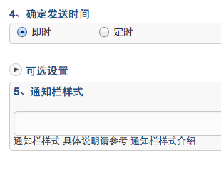

# Android SDK 教程

## Android SDK 网络问题解析

Android 客户端网络不稳定，会导致App 有时候无法及时收到 Push 消息。

很多开发者认为这是因为 JPush 推送不稳定、延迟，甚至有时候认为 JPush 后台推送系统出问题了。

本文目的是从各个方面来分析 Android 网络导致的 JPush 不能正常工作的问题。

### JPush 正常工作的必要条件

首先，我们需要知道，JPush SDK  并不是集成到App 后就必然一直工作的。

其正常工作的必要条件是：JPush SDK 与 JPush Server 的网络保持着连接。请参考这篇文章来做进一步的理解：[极光推送技术原理：移动无线网络长连接。](http://blog.jpush.cn/jpush_wireless_push_principle/)

而 Android 设备的网络的复杂性、不稳定性，是 Android 设备开发最复杂的地方之一。

另外，每款手机的网络能力也是千差万别的。国内很多杂牌手机在网络方面甚至会有严重的问题。大品牌厂商的手机则要好很多。

只要 JPush 的网络连接是正常的，则：

+ JPush 收到消息一定是及时的。其延迟是秒级的，一般在 1 秒之内。如果超过 10 秒，则一定是客户端网络出了问题。
+ 手机休眠时，也能够及时地收到推送消息。

### 部分系统的特殊处理导致问题

#### MIUI V5 系统

+ 自启动管理：默认情况下，手机开机后，只有系统默认的服务可以启动起来。除非在自启动管理界面，设置允许第三方程序自启动。

+ 网络助手：可以手动禁止已安装的第三方程序访问2G/3G和WIFI的网络和设置以后新安装程序是否允许访问2G/3G和WIFI的网络。

#### 4.0以上的android系统

+ 在设置－>应用，强行停止 应用程序后该程序无法再自启动，就算重新开机也一样，一定要手动开启才能运行起来。

### 让我们从目前得到的反馈来整理调试的思路

#### 手机休眠时收不到 JPush 消息，解锁或屏幕灯亮则可以成功接收

这个现象表明，手机休眠时，JPush SDK “被迫”与服务器端的网络失去了连接。

JPush SDK 的工作原理是要确保在手机休眠时也能正常的工作，即休眠时也可以及时地收到Push消息。实际上JPush在大部分上手机上都能达到此效果。

这个“被迫”，是由 Android 设备的环境所导致的。涉及的原因有如下几个方面：

+ 手机本身的网络设置。标准版本的 Android ROM 是没有这个设置的，但某些特殊的 ROM 可能会有这方面的设置。
+ 手机上的安全、省电工具软件额外做的事情

上述的特殊机制会关闭网络。网络一旦连接上，JPush也会连接上服务器，从而Push消息就会收到。

#### 有时候收到 JPush 消息很及时，有时候则要等几分钟

JPush 会监听网络切换广播。当网络关闭时，把原来JPush连接关闭。当有新的网络时，创建JPush连接。

另外，RTC会定时发送心跳。如果之前的网络已经断了，则会重新连接。

应该说，当前的网络连接策略还是相对简单的，这样做的目的是：省电、省流量。

不 好之处就是：网络没有切换时，因为当时网络过差，JPush连接会被中断。这种情况下，就只能等 RTC 心跳去触发连接。这也是有时候JPush 无法及时接收Push消息的原因。根据网络条件的不同，出现这个情况的概率也会不同。但据我们自己的测试，90% 的时候是可以及时地收到Push消息的。

JPush 目前在网络策略方面没有像微信这种聊天工具做得积极。如果这样做到，电量和流量的消耗必然会成倍地增加。

####完全收不到 JPush 消息

如果集成之后就完全收不到Push消息，则很有可能是某个地方配置错误。请根据文档仔细检查：Android SDK 集成指南，iOS SDK 集成指南，或者根据参考教程：Android SDK 调试指南，iOS SDK 调试指南。

## Android SDK 调试指南

### SDK启动过程

1. 检查AndroidManifest.xml中是否有配置AppKey，如果没有，则启动失败
2. 检查 Androidmanifest.xml文件配置的正确性，必须要保证“Android SDK 集成指南”中所有标注“ 
3. Required”的部分都正确配置，否则启动失败
4. 检查 JPush SDK库文件的有效性，如果库文件无效，则启动失败
5. 检查网络是否可用，如果网络可用则连接服务器登录，否则启动失败
6. 登陆成功后可以从log中看到如下log

### 测试确认

+ 确认 Androidmanifest.xml 中所需的所有 “Required” 项都已经添加。如果有 "Required" 项未添加，日志会提示错误。
+ 确认 AppKey (在Portal上生成的) 已经正确的写入 Androidmanifest.xml 中,没写会有日志提示错误。
+ 确认在程序启动时候调用了init(context) 接口
+ 确认测试手机（或者模拟器）的网络可用，如果网络正常可用，客户端调用 init 后不久，应有登录成功（Login succeed）的日志信息，如 SDK 启动过程所示
+ 启动应用程序，登陆 Portal 系统，并向应用程序发送自定义消息或者通知栏提示。在几秒内，客户端应可收到下发的通知或者正定义消息.

## 别名与标签使用教程

### 为什么需要别名与标签

推送消息时，要指定推送的对象：全部，某一个人，或者某一群人。

	JPush 目前还提供根据 IMEI 推送。但这个建议仅用于测试目的。原因很简单：很多 Android 设备是取不到 IMEI 的。
	
全部很好办，针对某应用“群发”就好了。Portal与API都支持向指定的 appKey 群发消息。

要指定向某一个特定的人，或者某一群特定的人，则相对复杂。因为对于 JPush 来说，某一个人就是一个注册ID，这个注册ID与开发者App没有任何关系，或者说对开发者App是没有意义的。

如果要对开发者App有意义的某个特定的用户推送消息，则需要：把 JPush 注册用户与开发者App 用户绑定起来。

这个绑定有两个基本思路：

+ 把绑定关系保存到 JPush 服务器端
+ 把绑定关系保存到开发者应用服务器中

前者，就是这里要说到的：别名与标签的功能。这个机制简单易用，适用于大多数开发者。

后者，则是 JPush 提供的另外一套 RegistrationID 机制。这套机制开发者需要有应用服务器来维护绑定关系，不适用于普通开发者。Android SDK r1.6.0 版本开始支持。

### 使用方式

别名与标签的机制，其工作方式是：

1. 客户端开发者App调用 setAliasAndTags API 来设置关系
2. JPush SDK 把该关系设置保存到 JPush Server 上
3. 在服务器端推送消息时，指定向之前设置过的别名或者标签推送

SDK 支持的 setAliasAndTags 请参考相应的文档：别名与标签 API

使用过程中有几个点做特别说明：

1. App 调用 SDK setAliasAndTags API 时，r1.5.0 版本提供了 Callback 来返回设置状态。如果返回 6002 （超时）则建议重试

	+ 老版本没有提供 Callback 无设置状态返回，从而没有机制确定一定成功。建议升级到新版本
	
2. Portal 上推送或者 API 调用向别名或者标签推送时，可能会报错：不存在推送目标用户。该报错表明，JPush Server 上还没有针对你所推送的别名或者标签的用户绑定关系，所以没有推送目标。这时请开发者检查确认，开发者App是否正确地调用了 setAliasAndTags API，以及调用时是否网络不好，JPush SDK 暂时未能保存成功。

### 使用别名

用于给某特定用户推送消息。

所谓别名，可以近似地被认为，是用户帐号里的昵称。

### 使用标签

用于给某一群人推送消息。

标签类似于博客里为文章打上 tag ，即为某资源分类。

#### 动态标签

JPush 提供的设置标签的 API 是在客户端的。开发者如何做到在自己的服务器端动态去设置分组呢？ 比如一个企业OA系统，经常需要去变更部门人员分组。以下是大概的思路：

+ 设计一种自定义消息格式（业务协议），App解析后可以调用 JPush SDK setAliasAndTags API 来重新设置标签（分组）
	+ 例：{"action":"resetTags", "newTags":["dep_level_1":"A公司", "dep_level_2":"技术部", "dep_level_3":"Android开发组", "address":"深圳", "lang":"zh"]}
+ 要动态设置分组时，推送这条自定义消息给指定的用户
	+ 使用别名的机制，推送到指定的用户。
+ 客户端App 调用 JPush SDK API 来设置新的标签

### 参考

[别名与标签 API]()

##别名与标签设置异常处理

由于网络连接不稳定的原因，有一定的概率 JPush SDK 设置别名与标签会失败。
		
App 开发者合理地处理设置失败，则偶尔失败对应用的正常使用 JPush 影响是有限的。

以下以 Android SDK 作为示例。

基本思路：

+ 设置成功时，往 SharePreference 里写状态，以后不必再设置
+ 遇到 6002 超时，则稍延迟重试。

		// 这是来自 JPush Example 的设置别名的 Activity 里的代码。一般 App 的设置的调用入口，在任何方便的地方调用都可以。 
		private void setAlias() {
		    EditText aliasEdit = (EditText) findViewById(R.id.et_alias);
		    String alias = aliasEdit.getText().toString().trim();
		    if (TextUtils.isEmpty(alias)) {
		        Toast.makeText(PushSetActivity.this,R.string.error_alias_empty, Toast.LENGTH_SHORT).show();
		        return;
		    }
		    if (!ExampleUtil.isValidTagAndAlias(alias)) {
		        Toast.makeText(PushSetActivity.this,R.string.error_tag_gs_empty, Toast.LENGTH_SHORT).show();
		        return;
		    }
		
		    // 调用 Handler 来异步设置别名
		    mHandler.sendMessage(mHandler.obtainMessage(MSG_SET_ALIAS, alias));
		}

		private final TagAliasCallback mAliasCallback = new TagAliasCallback() {
		    @Override
		    public void gotResult(int code, String alias, Set<String> tags) {
		        String logs ;
		        switch (code) {
		        case 0:
		            logs = "Set tag and alias success";
		            Log.i(TAG, logs);
		            // 建议这里往 SharePreference 里写一个成功设置的状态。成功设置一次后，以后不必再次设置了。
		            break;
		        case 6002:
		            logs = "Failed to set alias and tags due to timeout. Try again after 60s.";
		            Log.i(TAG, logs);
		            // 延迟 60 秒来调用 Handler 设置别名
		            mHandler.sendMessageDelayed(mHandler.obtainMessage(MSG_SET_ALIAS, alias), 1000 * 60);
		            break;
		        default:
		            logs = "Failed with errorCode = " + code;
		            Log.e(TAG, logs);
		        }
		        ExampleUtil.showToast(logs, getApplicationContext());
		    }
		};
		private static final int MSG_SET_ALIAS = 1001;
		private final Handler mHandler = new Handler() {
		@Override
		    public void handleMessage(android.os.Message msg) {
		        super.handleMessage(msg);
		        switch (msg.what) {
		        	case MSG_SET_ALIAS:
		        		Log.d(TAG, "Set alias in handler.");
		                // 调用 JPush 接口来设置别名。
		            	JPushInterface.setAliasAndTags(getApplicationContext(),
		            							        (String) msg.obj, 
		            							         null,
		            							         mAliasCallback);
		            break;
		        default:
		            Log.i(TAG, "Unhandled msg - " + msg.what);
		        }
		    }		        				        
		};
		
			
## 自定义通知栏样式教程

### 关于自定义通知栏样式

JPush 通知推送到客户端时，默认使用手机的默认设置来显示通知栏，包括铃声、震动等效果。

如果开发者想要达到如下的效果，则需要使用“自定义通知栏样式”功能：

+ 通知栏样式使用与默认不一样的设置，比如想要控制：
	+ 铃声、震动
	+ 显示图标
	+ 替换默认的通知栏样式。
 
### 推送消息指定通知栏样式编号

通知栏样式在服务器端向下推送时，只体现为一个编号（数字）。

	推送通知的样式编号，应该是在客户端做了自定义通知栏样式设置的。

	如果通知上的样式编号，在客户端检查不存在，则使用默认的通知栏样式。
	
开发者不自定义通知栏样式时，则此编号默认为 0。

开发者自定义的通知栏样式编号应大于 0，小于 1000。

在 Portal 上发送通知时，最下边的“可选”部分展开，开发者可指定当前要推送的通知的样式编号。如下图所示：

### 客户端定义通知栏样式

自定义的通知栏样式，是在客户端进行的。请参考 [通知栏样式定制API]() 来看所支持的功能。

####自定义通知栏样式设计

+ 有个 PushNotificationBuilder 概念，开发者使用 setPushNotificationBuilder 方法为某种类型的 PushNotificationBuilder 指定编号。
+ setPushNotificationBuilder 可以在 JPushInterface.init() 之后任何地方调用，可以是开发者应用的逻辑来触发调用，或者初始化时调用。
+ 只需要设置一次，JPush SDK 会记住这个设置。在下次收到推送通知时，就根据通知里指定的编号来找到 PushNotificationBuilder 来展现、执行。

#### API - setDefaultPushNotificationBuilder 设置默认

此 API 改变默认的编号为 0 的通知栏样式。

#### API - setPushNotificationBuilder 指定编号

此 API 为开发者指定的编号，设置一个自定义的 PushNotificationBuilder（通知样式构建器）。

####Example - 基础的 PushNotificationBuilder

定制声音、震动、闪灯等 Notification 样式。

	BasicPushNotificationBuilder builder = new BasicPushNotificationBuilder(MainActivity.this);
	builder.statusBarDrawable = R.drawable.jpush_notification_icon;
	builder.notificationFlags = Notification.FLAG_AUTO_CANCEL;  //设置为自动消失
	builder.notificationDefaults = Notification.DEFAULT_SOUND ｜ Notification.DEFAULT_VIBRATE | Notification.DEFAULT_LIGHTS;  // 设置为铃声与震动都要
	JPushInterface.setPushNotificationBuilder(1, builder);
	
####Example - 高级自定义的 PushNotificationBuilder

基于基础的 PushNotificationBuilder，可进一步地定制 Notification 的 Layout。

`这里作为 example 的 customer_notitfication_layout 在我们的 example 项目的 /res/layout/ 下可以找到。你完全可以用自己的 layout。`

	CustomPushNotificationBuilder builder = new 
	CustomPushNotificationBuilder(MainActivity.this,
	                          R.layout.customer_notitfication_layout, 
	                          R.id.icon, 
	                          R.id.title, 
	                          R.id.text); 
	                         // 指定定制的 Notification Layout
	builder.statusBarDrawable = R.drawable.your_notification_icon;      
	// 指定最顶层状态栏小图标
	builder.layoutIconDrawable = R.drawable.your_2_notification_icon;   
	// 指定下拉状态栏时显示的通知图标
	JPushInterface.setPushNotificationBuilder(2, builder);                

###通知栏样式定义不符合要求？

以上提供的自定义通知栏样式的功能是有限的。比如：Android SDK 4.0 以后的 [Notification](http://developer.android.com/reference/android/app/Notification.html) 支持指定 Style ，而这种复杂的通知样式定义 JPush SDK 还未有支持。

或者你想要自定义的复杂的通知样式，但不愿意使用上述高级的自定义通知栏定制功能。

建议不要使用 JPush 提供的通知功能，而使用自定义消息功能。

即：推送自定义消息到客户端后，App取到自定义消息全部内容，然后App自己来写代码做通知的展示。请参考文档：通知 vs. 自定义消息。

###参考

+ [通知栏样式定制 API]()

##通知 vs. 自定义消息

极光推送包含有通知与自定义消息两种类型的推送。本文描述他们的区别，以及建议的应用场景。

只有 Android 支持自定义消息。

### 两者的区别

#### 功能角度

##### 通知

或者说 Push Notification，即指在手机的通知栏（状态栏）上会显示的一条通知信息。这是 Android / iOS 的基本功能。

一条通知，简单的填写纯文本的通知内容即可。

通知主要用于提示用户的目的。应用加上通知功能，有利于提高应用的活跃度。

##### 自定义消息

是极光推送自己的概念。

自定义消息不是通知，所以不会被SDK展示到通知栏上。其内容完全由开发者自己定义。

自定义消息主要用于应用的内部业务逻辑。一条自定义消息推送过来，有可能没有任何界面显示。

	本质上：自定义消息是原始的消息，JPush SDK 不做处理。而通知，则 JPush SDK 会做通知展示处理，其目的是为了减轻开发人员的工作量。

	所以，如果通知功能不太符合您的需求，你都可以使用自定义消息来实现（客户端展现App自己来做）。

#### 开发者使用角度

##### 通知

简单场景下的通知，用户可以不写一行代码，而完全由 SDK 来负责默认的效果展示，以及默认用户点击时打开应用的主界面。

JPush Android SDK 提供了 API 让开发者来定制通知栏的效果，请参考：自定义通知栏样式教程；也提供了 接收推送消息Receiver 让你来定制在收到通知时与用户点击通知时的不同行为。

##### 自定义消息

SDK 不会把自定义消息展示到通知栏。

所以调试时，需要到日志里才可以看到服务器端推送的自定义消息。

自定义消息一定要由开发者写[ 接收推送消息Receiver]() 来处理收到的消息。

### 使用通知  

请参考以下示例代码。

__插入代码__

### 使用自定义消息

使用自定义消息，在客户端App里一定要写代码，去接受 JPush SDK 的广播，从而取得推送下来的消息内容。具体请参考文档：接收推送消息Receiver。

以下代码来自于推聊。

__插入代码__

### 参考
+ [接收推送消息Receiver
]()
+ [自定义通知栏样式教程
]()
+ [通知栏样式定制 API
]()